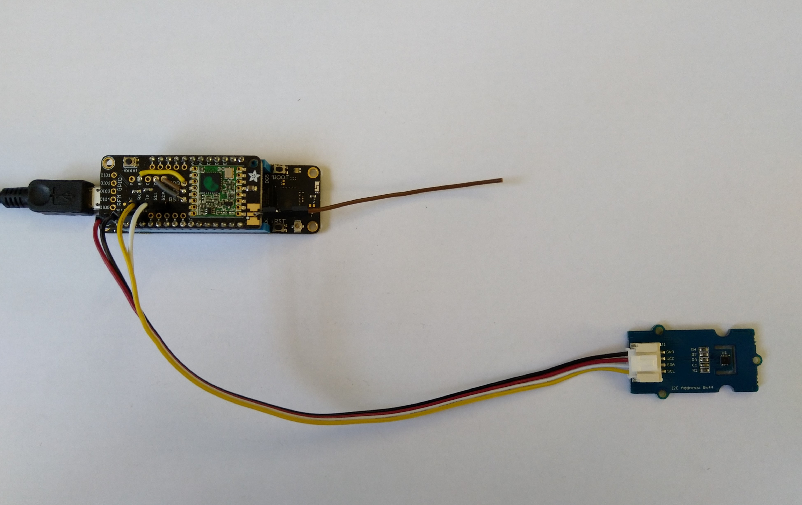

# FieldGateway.LoRa.MeadowClient
Sample Wilderness Labs [Meadow](https://www.wildernesslabs.co/meadow) client for my [LoRa](https://lora-alliance.org/) field gateway projects.

Beta version with no power consumsuption management and limited error handling.

This sample uses my [RFM9XLoRa-Meadow](https://github.com/KiwiBryn/RFM9XLoRa-Meadow) library and the Wilderness Labs [Meadow Foundation](http://developer.wildernesslabs.co/docs/api/Meadow.Foundation/Meadow.Foundation.Sensors.Atmospheric.Sht31D.html)

